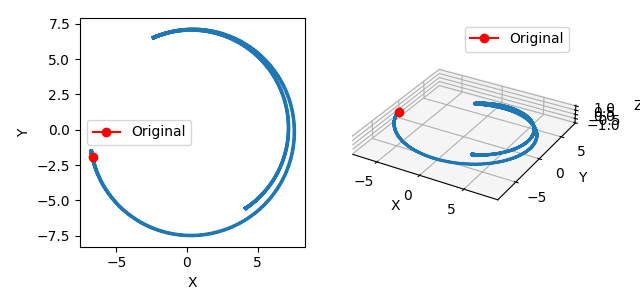

# Boris

A high-performance computing library for calculating particle trajectories of charged particles using the boris algorithm, based on Python3.8 and C++.

## Introduce

`boris` algorithm \([Why is Boris algorithm so good?](https://pubs.aip.org/aip/pop/article-abstract/20/8/084503/317652/Why-is-Boris-algorithm-so-good?redirectedFrom=fulltext)\) can calculate the advance of a particle with a given position and velocity under a three-dimensional electromagnetic field.

This library implements `boris` algorithm and supports multi-threaded parallel computation, which can greatly accelerate the speed of trajectory promotion. Using this library, it takes 12.3 seconds for 30,000 particles to advance 10,000 steps in 1 thread. With 32 threads, the time is reduced to 1 second. The memory consumption of the library is small, about 14G for the above scenario, which is consistent with the `numpy` matrix size of `30000x10000x6`, and almost all of the memory is used for data storage.

The calculation of this library assumes that the electromagnetic field is a tokamak electromagnetic field, the particle is a α particle, and the default parameters are stored and can be adjusted.

## Environment

**!! Python3.8 Required !!**

```shell
pip install numpy matplotlib tqdm
```

## Example

引入相关库

```python
import os
import numpy as np
from boris import Boris
import matplotlib.pyplot as plt
```

初始化Boris实例

```
boris = Boris()
```

随机生成初始粒子的位置和速度，这里指定粒子的个数为30000个。粒子的位置在整个托卡马克环空间内随机。

```python
x0, v0 = boris.random_x_v(30000)
print(x0.shape, v0.shape)
```

```
>>> (30000, 3) (30000, 3)
```

调用boris库完成30000个粒子各自的10000步推进，打开性能分析`info=True`查看详细信息：

```python
threads = os.cpu_count()
data = boris.run(x0, v0, steps=10000, threads=threads, info=True)
print(data.shape)
```

```
>>> Using threads: 32, prepare memory + start calculating...done (1.138s)
>>> (30000, 10001, 6)
```

展示其中一个粒子的计算轨迹：

```python
i = np.random.randint(low=0, high=data.shape[0] - 1)

plt.figure()

ax1 = plt.subplot(1, 2, 1)
plt.plot(data[i, :, 0], data[i, :, 1])
plt.xlabel('X')
plt.ylabel('Y')
ax1.set_aspect('equal')
plt.plot(data[i, 0, 0], data[i, 0, 1], marker='o', color='r', label='Original')
plt.legend()

ax2 = plt.subplot(1, 2, 2, projection='3d')
plt.plot(data[i, :, 0], data[i, :, 1], data[i, :, 2])
plt.xlabel('X')
plt.ylabel('Y')
ax2.set_zlabel('Z')
ax2.set_aspect('equal')
plt.plot(data[i, 0, 0], data[i, 0, 1], data[i, 0, 2], marker='o', color='r', label='Original')
plt.legend()

plt.show()
```

